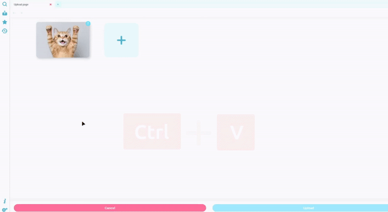
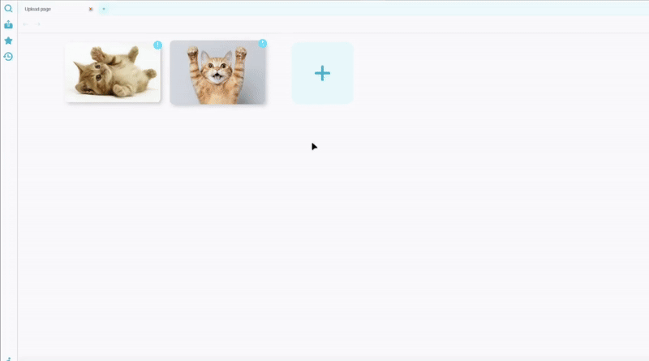
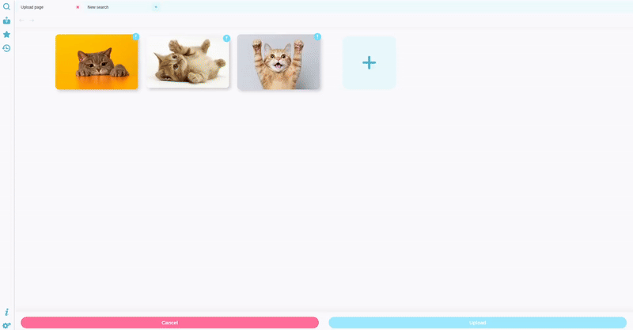
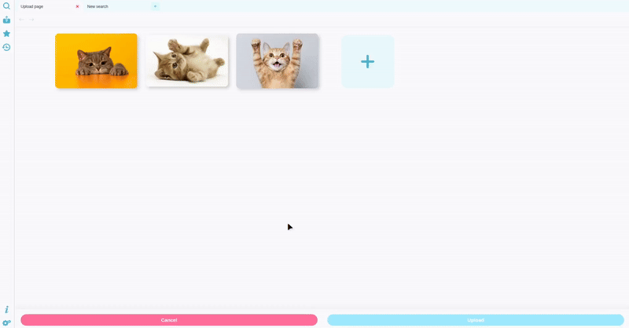
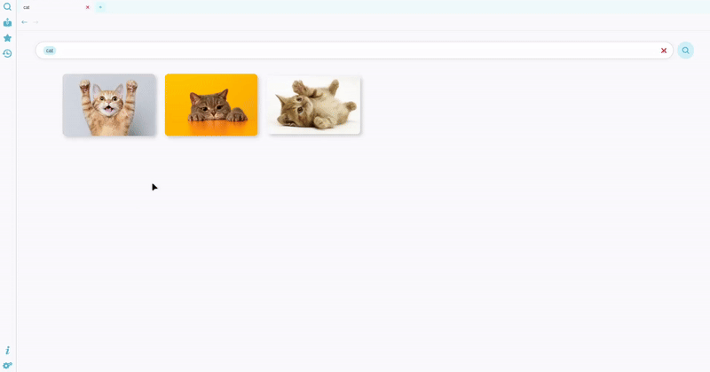
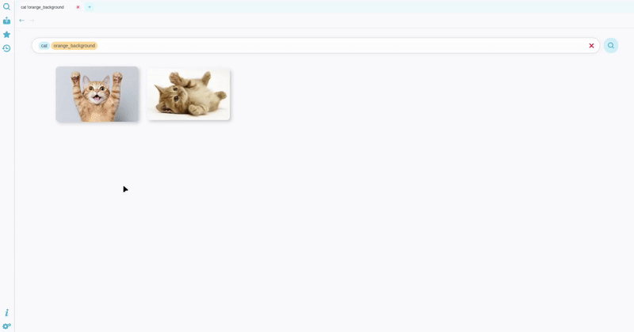
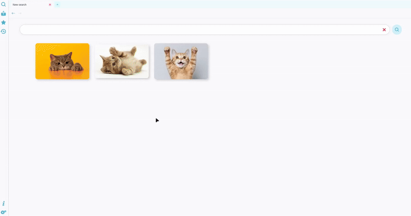

# Ciel
Ciel is an intuitive **image tagging** application built with Electron.

It helps you to effortlessly organize and manage your image collection through a flexible tagging system. With Ciel, you can quickly find, categorize, and keep track of all your images in one convenient place.
## Adding images
### Uploading
The application has no images when installed for the first time, so let's add some!

First, click the *Upload* icon:

Inside an upload page you can upload any number of images you want. You can do it by either clicking the *Add* button, dropping the images or pasting them.

The image doesn't even need to be previosly downloaded in your computer, just drop or paste it and Ciel will download it for you! (Be sure you are trying to upload a proper image and not the link of a page)

### Tagging
Now that we have some images to work on, we should add them some tags. To do so, you can select the image you want to tag by clicking it. 

An editor will show up with a blank box where you can start writing the tags. To actually add a tag you need to press Spacebar after writing it (or either Tab or Enter if the autocompleter has some suggestions, don't worry if it doesn't have any now, since it's the first time the app doesn't have any tags registered yet).

You can also select many images at once (you can select all or just some by clicking them while pressing the Ctrl key).

To finish uploading the images, just click the blue *Upload* button on the bottom of the screen.

## Searching images
Tagging an image is useless if you can't find it, so let's see how we can search them. 

First you want to open a search page.

Now all you have to do is write the tags you want to look for.

But let's not limit ourselves to one tag, we can combine them. If we use many tags, we will find the images that have **all** the tags used in the search. *(In the example, cat images with a orange background)*

We can also search for images that **don't** have a specific tag. *(In the example, cat images that **don't** have an orange background)*

You can exclude a tag from the search by right clicking it and select the "Exlude tag from search" option, or you can do that directly by writing the tag preceeded by "!". 

### Favourites
If you find yourself doind the same search once and again, you can even set a search page as a favourite so you can always keep it around you.

### Gallery
Also, if you just want to see all the images like in a gallery, you can just press the search button with no tags specified.

## Editing an image tags
From a search page, you can also edit your images' tags.

